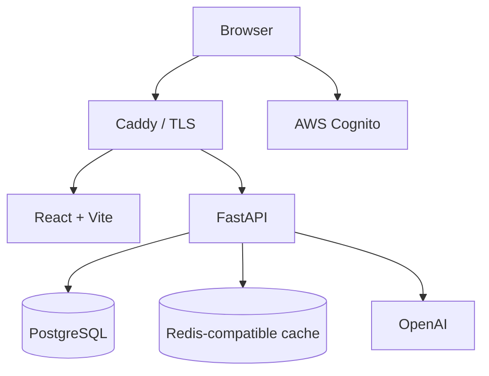

# QuizForge AI

[](https://github.com/HamedGithubforwork/QuizForge-AI/actions/workflows/ci.yml)

**QuizForge AI turns PDF notes into source-grounded practice quizzes, tracks performance over time, and generates targeted practice from weak areas.**

[Production](https://quizfromnotes.com) · [API health](https://api.quizfromnotes.com/api/health)

The current production stack runs on AWS Lightsail with Cognito authentication, PostgreSQL, Redis-compatible caching/coordination, Caddy TLS termination, and a FastAPI + React application. A small legacy Supabase compatibility path remains in the pinned application candidate and local-development setup while the migration is finalized.

## What it does

1. Sign in.
2. Upload a PDF.
3. Extract selectable text, with Tesseract OCR fallback for sparse scanned pages.
4. Choose quiz length, difficulty, and question type.
5. Generate source-grounded questions through OpenAI.
6. Answer and review explanations with cited source pages.
7. Save attempts and view score/history analytics.
8. Generate new practice focused on weak question types or source pages.

### Engineering highlights

- **Grounded AI generation** — returned questions, answers, explanations, and source pages are validated against the uploaded document.
- **Selective OCR** — normal text PDFs stay on the fast PyMuPDF path; sparse raster pages can fall back to Tesseract.
- **Bounded retrieval** — large documents keep full page data for source lookup while quiz generation uses a deterministic bounded context.
- **Stable document identity** — SHA-256 identity associates history with the same PDF even after a rename.
- **Adaptive practice** — recent mistakes and weak areas feed targeted follow-up quizzes without simply replaying the same missed questions.
- **Redis coordination** — caching, rate limiting, processed-document reuse, source-page retrieval, single-flight generation locking, and operational metrics share a Redis-compatible backend.
- **Deterministic validation** — Pydantic schemas plus structural, grading, and source-grounding checks reject malformed model output before it reaches the browser.
- **Production safeguards** — privacy-conscious logging, bounded AI spending, backup/recovery workflows, MFA, least-privilege GitHub OIDC sessions, and deployment canaries are part of the repository.

## Screenshots

### Upload and configure


### Quiz review


## Features

### Quiz generation

- PDF upload and selectable-text extraction
- English OCR fallback for scanned/image pages
- 5, 10, or 15 questions
- Easy, Medium, and Hard difficulty
- Multiple Choice, True / False, Short Answer, or Mixed modes
- AI-generated explanations
- Authenticated source-page retrieval
- Prompt-injection-resistant document handling
- One bounded regeneration attempt when provider output violates the quiz contract
- Reuse of already processed documents
- Explicit fresh-generation cache bypass

### Quiz experience

- Question navigator
- Unanswered-question checks
- Overall and per-type score breakdowns
- Retry Incorrect
- Generate New Quiz
- Deterministic short-answer grading
- Numeric-unit normalization for common measurement families
- Conservative AI review for selected borderline short answers
- Lazy source-page fetching with bounded frontend caching

### Learning history

- Persistent attempt history
- Cursor-based history pagination
- Recent score trends
- Weak question-type detection
- Weak source-page detection
- Targeted weak-area practice
- Mastery tracking based on repeated recent evidence

### Account and security flows

- Sign up / sign in
- Email verification
- Forgot/reset password
- Optional TOTP MFA
- SMS MFA activation path once AWS End User Messaging SMS prerequisites are approved
- Session refresh/retry behavior
- Production Cognito hosted login with a guarded identity/recovery path

## Current architecture



| Layer | Current production role |
| --- | --- |
| Frontend | React + TypeScript + Vite, served from the permanent Lightsail deployment |
| API | FastAPI / Python 3.11 |
| Public TLS / routing | Caddy |
| Authentication | AWS Cognito, with retained legacy compatibility code where still required by the pinned candidate |
| Database | PostgreSQL |
| Cache / coordination | Redis-compatible runtime |
| PDF / OCR | PyMuPDF + Tesseract |
| AI | OpenAI Responses API |
| Cloud | AWS Lightsail + supporting AWS services |
| CI/CD | GitHub Actions + GitHub OIDC |
| Infrastructure | Terraform |

The top-level historical ECS/VPC foundation remains in Terraform because it still owns remote-state resources. It is not the current serving path and should not be removed without a deliberate state reconciliation.

## Request boundaries

| Flow | Path |
| --- | --- |
| Login | Browser → Cognito |
| Upload/process PDF | Browser → FastAPI → PyMuPDF / optional Tesseract |
| Generate quiz | Browser → FastAPI → Redis / OpenAI |
| Save/load history | Application → PostgreSQL |
| View cited source | Browser → FastAPI → processed-document cache |
| Weak-area practice | History analytics → FastAPI → new grounded quiz |

## Caching, limits, and coordination

Quiz generation separates reusable document work from generated-quiz caching.

- Processed document cache: 24 hours by default
- Quiz cache: 1 hour by default
- Quiz-generation rate limit: 10 requests per 10 minutes by default
- Generation single-flight locking prevents duplicate concurrent work for identical requests
- Source pages are retrieved lazily rather than returning entire processed documents to the browser
- Redis failures follow explicit fallback/fail-closed paths rather than fabricating success

The production repository also contains a separate monthly AI spending guard. Admission reserves worst-case bounded model cost before a provider call and settles against reported usage afterward.

## Security and production engineering

QuizForge treats uploaded documents, authentication, model output, databases, caches, and external providers as separate trust boundaries.

- Protected API operations require an authenticated user.
- Uploaded files are type/size checked and parsed under bounded processing rules.
- AI output must pass schema and deterministic structural/source validation.
- CORS is allowlist-based.
- Production responses carry security headers.
- Secrets remain outside source control.
- Redis keys and logs avoid storing raw bearer tokens or PDF text.
- Admin metrics are separately protected.
- GitHub Actions uses temporary AWS credentials through OIDC instead of long-lived access keys.
- Production backup/recovery workflows use bounded IAM session policies and sanitized artifacts.
- Cognito SMS activation is manual and guarded by a read-only inspection mode plus explicit confirmation.

## Testing and CI

The repository uses layered validation rather than one monolithic test job.

| Layer | Coverage |
| --- | --- |
| Backend | pytest API, auth, PDF/OCR, caching, rate limits, validation, observability |
| Frontend | Node tests, coverage thresholds, lint, Vite production build |
| Mutation | StrykerJS on selected frontend business logic |
| Browser | Playwright flows and axe accessibility checks |
| Integration | local authenticated stack / Redis / database boundaries |
| Dependencies | pip/npm audits |
| Production ops | Lightsail configuration rehearsal, backup/restore checks, recovery drill validation, production canaries |

Frontend coverage gates are currently:

```text
Lines:     90%
Branches:  80%
Functions: 90%
```

Run the common local checks with:

```bash
# Backend
cd backend
python -m pytest

# Frontend
cd ../frontend
npm ci
npm run test:coverage
npm run lint
npm run build

# Browser tests from repository root
cd ..
npm --prefix e2e ci
npm --prefix e2e test
```

## Local development

### Prerequisites

- Git
- Python 3.11.16
- Node.js 22+
- Docker Desktop or a local Redis instance
- OpenAI API key
- local Supabase-compatible development credentials for the retained compatibility path
- Tesseract + English data only when running OCR manually outside Docker

### Docker Compose

```bash
git clone https://github.com/HamedGithubforwork/QuizForge-AI.git
cd QuizForge-AI
```

Create local files from the committed examples:

```text
backend/.env.example   → backend/.env
frontend/.env.example → frontend/.env.local
```

Then:

```bash
docker compose up --build
```

Local endpoints:

```text
Frontend  http://localhost:5173
Backend   http://localhost:8000
```

Stop with:

```bash
docker compose down
```

### Manual backend/frontend

Backend:

```bash
cd backend
python -m venv .venv
pip install -r requirements.txt
uvicorn main:app --reload
```

Frontend in another terminal:

```bash
cd frontend
npm ci
npm run dev
```

Use the committed environment examples as the configuration source of truth. Never commit real secret values.

## Repository map

```text
QuizForge-AI/
├── backend/                    FastAPI, PDF/OCR, AI orchestration, tests
├── frontend/                   React + TypeScript UI and unit/mutation tests
├── e2e/                        Playwright suites and production canary tests
├── infra/aws/                  retained AWS foundation + active Lightsail Terraform
├── scripts/production/         deployment, backup, recovery, cost and identity controllers
├── scripts/backup_activation/  guarded retained-backup activation tooling
├── docs/                       active operational docs and retained evidence
├── .github/workflows/          CI/CD and production maintenance workflows
└── docker-compose.yml          local development stack
```

Historical migration/rehearsal tooling removed from `main` is preserved on
`archive/aws-migration-2026-09-26`; see
[`docs/migration-archive.md`](docs/migration-archive.md).

## Current limitations

- OCR is optimized for English scanned text.
- Password-protected PDFs are unsupported.
- Large documents use a bounded generation context rather than sending every extracted character to the model.
- Processed-document data is temporary and can expire.
- Model generation requires an external provider request on cache miss/bypass.
- A legacy Supabase compatibility path remains until the pinned application candidate is fully retired.

## Author

**Hamed Vasheghani Farahani**  
Computer Science student at Concordia University.

GitHub: https://github.com/HamedGithubforwork
