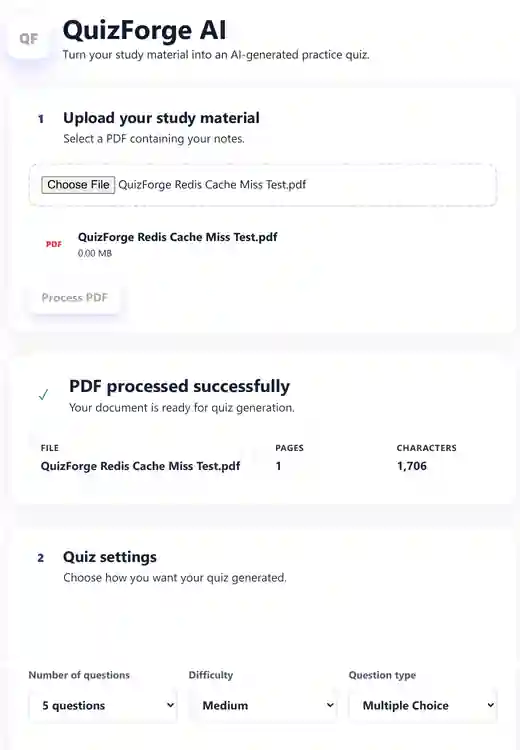
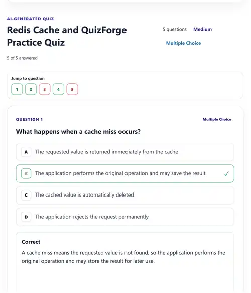
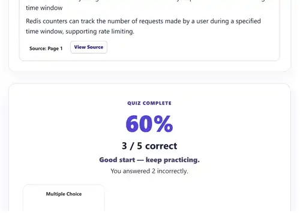
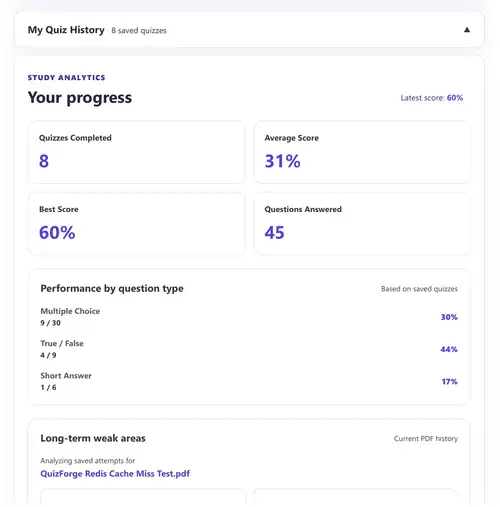

# QuizForge AI

[](https://github.com/HamedGithubforwork/QuizForge-AI/actions/workflows/ci.yml)

AI-powered study platform that converts PDF study material into interactive practice quizzes with explanations, source-page references, performance analytics, personalized weak-area practice, and Redis-backed caching.

🌐 **Live Demo:** https://quiz-forge-ai-nine.vercel.app  
⚙️ **Backend API:** https://quizforge-ai-api.onrender.com  
✅ **API Health:** https://quizforge-ai-api.onrender.com/api/health

---

## Overview

QuizForge AI is a deployed full-stack web application that allows users to upload PDF study material and generate AI-powered quizzes based directly on document content.

The application tracks quiz performance over time, identifies weak areas, and generates targeted practice quizzes based on previous mistakes.

The backend uses Redis caching to avoid unnecessary repeated AI generation requests and Redis-backed per-user rate limiting to control quiz-generation traffic.

The project includes:

- React + TypeScript frontend
- Python + FastAPI backend
- OpenAI-powered quiz generation
- PostgreSQL persistence
- Supabase authentication
- Redis caching
- Redis-backed rate limiting
- Automated testing
- GitHub Actions CI
- Docker development
- Production deployment on Vercel and Render

---

## Features

### Quiz Generation

- PDF upload and text extraction
- AI-generated quizzes based on uploaded content
- Multiple Choice questions
- True / False questions
- Short Answer questions
- Mixed question types
- Easy, Medium, and Hard difficulty
- 5, 10, or 15-question quizzes
- AI-generated explanations
- Source-page references
- View Source functionality

### Quiz Experience

- Question navigation
- Quiz scoring
- Question-type performance breakdown
- Retry Incorrect Questions
- Smart short-answer matching

### Personalized Learning

- Persistent quiz history
- Performance analytics
- Weak-area detection
- Targeted weak-area practice
- Mastery progress tracking
- Practice based on previous incorrect answers
- Practice based on weak source pages
- Practice based on weak question types

### Authentication & Security

- Email/password authentication
- Email confirmation
- Login and logout
- Forgot Password
- Password reset
- Protected backend endpoints
- Supabase access-token verification
- Row Level Security
- Configurable CORS
- Security response headers
- Server-side OpenAI credentials

### Performance & Reliability

- Redis quiz caching
- Per-user Redis rate limiting
- Configurable cache expiration
- Automatic in-memory rate-limit fallback if Redis is unavailable
- Docker health checks
- Automated backend tests
- Frontend linting
- Production build validation
- GitHub Actions CI

---

## Tech Stack

### Frontend

- React
- TypeScript
- Vite
- Supabase JavaScript Client
- HTML / CSS

### Backend

- Python
- FastAPI
- Pydantic
- PyMuPDF
- OpenAI API
- HTTPX

### Database & Authentication

- Supabase
- PostgreSQL
- Supabase Auth
- Row Level Security (RLS)

### Caching & Rate Limiting

- Redis
- Redis Async Client
- TTL-based quiz caching
- Redis-backed per-user request counters

### Testing & DevOps

- pytest
- GitHub Actions
- Docker
- Docker Compose
- Git
- GitHub

### Deployment

- Vercel — frontend
- Render — FastAPI backend
- Render Key Value — Redis-compatible cache
- Supabase — PostgreSQL and authentication

---

## Architecture

```text
                            User
                              │
                              ▼
                 ┌───────────────────────┐
                 │    React + Vite       │
                 │       Vercel          │
                 └───────────┬───────────┘
                             │
                    Authenticated API
                         Requests
                             │
                             ▼
                 ┌───────────────────────┐
                 │       FastAPI         │
                 │        Render         │
                 └─────┬─────┬─────┬─────┘
                       │     │     │
              ┌────────┘     │     └─────────┐
              ▼              ▼               ▼
           Redis         OpenAI API       Supabase
        Cache + Rate                       Auth + DB
          Limiting
                             │
                             ▼
                       PDF Processing
                         PyMuPDF
```

The React frontend authenticates users through Supabase and sends the user's access token with protected API requests.

FastAPI verifies the access token before allowing protected PDF-processing and quiz-generation operations.

OpenAI is accessed only through the backend, preventing the OpenAI API key from being exposed in the browser.

Redis is used to cache previously generated quizzes and maintain per-user rate-limit counters.

Supabase PostgreSQL stores persistent quiz history and performance data.

---

## Redis Caching

Quiz generation can require an external AI request, so QuizForge uses Redis to avoid unnecessarily regenerating identical quizzes.

Before generating a quiz, the backend creates a cache fingerprint using information including:

- Authenticated user
- PDF contents
- Number of questions
- Difficulty
- Question type
- Practice configuration

The backend then checks Redis for an existing quiz.

```text
Quiz Request
     │
     ▼
Build Cache Key
     │
     ▼
Check Redis
   /     \
 HIT     MISS
  │        │
  │        ▼
  │    OpenAI API
  │        │
  │        ▼
  │    Store in Redis
  │        │
  └────────┴──────► Return Quiz
```

### Cache Hit

If an identical quiz already exists in Redis:

```text
Redis cache HIT
```

The cached quiz is returned without another OpenAI generation request.

### Cache Miss

If no matching quiz exists:

```text
Redis cache MISS
```

QuizForge generates the quiz normally and stores the result in Redis for future requests.

The default cache TTL is:

```text
3600 seconds
```

or approximately one hour.

The cache is stored separately from the FastAPI process, allowing cached quizzes to remain available across backend process restarts while the Redis service remains available.

---

## Redis Rate Limiting

QuizForge also uses Redis for per-user quiz-generation rate limiting.

Each authenticated user receives a Redis-backed request counter.

The default configuration allows:

```text
10 quiz-generation requests
per 600 seconds
```

The values can be changed through environment variables.

If Redis becomes unavailable, the application falls back to an in-memory rate limiter so quiz-generation protection remains available.

---

## Quiz Generation

Users can configure:

- Number of questions: 5, 10, or 15
- Difficulty: Easy, Medium, or Hard
- Question type:
  - Multiple Choice
  - True / False
  - Short Answer
  - Mixed

Generated questions can contain:

- Correct answer
- Explanation
- Source page
- Question type

---

## Personalized Practice

QuizForge AI analyzes previous quiz performance to identify areas where a user needs more practice.

Targeted quizzes can use:

- Incorrect answers
- Weak source pages
- Weak question types
- Historical quiz performance

The application also tracks mastery progress by comparing targeted-practice performance with the user's previous performance.

---

## Authentication & Security

QuizForge AI uses Supabase Authentication.

Supported authentication functionality includes:

- Account creation
- Email confirmation
- Login
- Logout
- Forgot password
- Password reset

The FastAPI backend includes:

- Supabase access-token verification
- Protected PDF upload endpoints
- Protected quiz-generation endpoints
- Configurable CORS
- Security response headers
- Redis-backed per-user rate limiting
- Server-side OpenAI API credentials

Sensitive environment variables are not committed to GitHub.

---

## Database Security

Quiz history and performance data are stored in Supabase PostgreSQL.

Row Level Security policies restrict users to accessing their own application data.

---

## Automated Testing

Run backend tests with:

```bash
cd backend
python -m pytest -q
```

The backend test suite covers areas including:

- API health
- Authentication requirements
- PDF validation
- PDF text extraction
- Scanned-PDF detection
- Quiz configuration validation
- Weak-area parsing
- Invalid request handling
- Redis cache-key generation
- Redis rate limiting

Frontend checks:

```bash
cd frontend
npm run test:grader
npm run lint
npm run build
```

---

## Continuous Integration

GitHub Actions automatically runs CI checks on pushes and pull requests.

The pipeline validates both the backend and frontend before changes are merged or deployed.

```text
GitHub Push / Pull Request
            │
            ▼
      GitHub Actions
       /          \
      ▼            ▼
   Backend      Frontend
   pytest       grader tests
                lint
                production build
       \          /
        ▼        ▼
          CI Result
```

This helps prevent broken code from reaching production.

---

## Local Development

### 1. Clone the repository

```bash
git clone https://github.com/HamedGithubforwork/QuizForge-AI.git
cd QuizForge-AI
```

### 2. Backend Setup

```bash
cd backend
python -m venv .venv
```

Activate the virtual environment on Windows:

```powershell
.\.venv\Scripts\Activate.ps1
```

Install dependencies:

```bash
pip install -r requirements.txt
```

Create:

```text
backend/.env
```

Use `backend/.env.example` as the template.

When running without Docker, configure `REDIS_URL` to point to an accessible Redis instance.

Start the Redis-enabled FastAPI application:

```bash
uvicorn main_redis:app --reload
```

Backend:

```text
http://127.0.0.1:8000
```

### 3. Frontend Setup

```bash
cd frontend
npm install
```

Create:

```text
frontend/.env.local
```

Use `frontend/.env.example` as the template.

Start Vite:

```bash
npm run dev
```

Frontend:

```text
http://localhost:5173
```

---

## Docker Development

The complete development stack can be started with Docker Compose.

From the project root:

```bash
docker compose up --build
```

Docker Compose starts:

```text
Redis     → Internal Redis service
Backend   → http://localhost:8000
Frontend  → http://localhost:5173
```

The backend waits for the Redis health check before starting.

Stop the containers with:

```bash
docker compose down
```

---

## Environment Variables

### Backend

```env
OPENAI_API_KEY=
SUPABASE_URL=
SUPABASE_PUBLISHABLE_KEY=
ALLOWED_ORIGINS=

REDIS_URL=

QUIZ_RATE_LIMIT=10
QUIZ_RATE_WINDOW_SECONDS=600

QUIZ_CACHE_TTL_SECONDS=3600
QUIZ_CACHE_VERSION=v1
```

### Frontend

```env
VITE_SUPABASE_URL=
VITE_SUPABASE_PUBLISHABLE_KEY=
VITE_API_URL=
```

See the included `.env.example` files for configuration templates.

---

## Deployment

QuizForge AI uses a split production architecture.

### Frontend — Vercel

https://quiz-forge-ai-nine.vercel.app

Vercel hosts the React + TypeScript frontend.

### Backend — Render

https://quizforge-ai-api.onrender.com

Render hosts the FastAPI API using:

```bash
uvicorn main_redis:app --host 0.0.0.0 --port $PORT
```

### Redis — Render Key Value

The production backend connects to a Redis-compatible Render Key Value instance.

Redis provides:

- Quiz caching
- Cache expiration
- Per-user rate-limit counters

### Database & Authentication — Supabase

Supabase provides:

- PostgreSQL
- Authentication
- Email confirmation
- Password recovery
- Row Level Security

> The free Render backend may sleep after periods of inactivity, so the first request can take longer while the service wakes up.

---

## Production Cache Validation

Redis caching has been tested against the deployed application.

A new PDF and quiz configuration produces:

```text
Redis cache MISS
```

Repeating the same request produces:

```text
Redis cache HIT
```

The cache was also successfully retrieved after the FastAPI service restarted, confirming that cached data is stored independently of the backend process.

---

## Screenshots

### Upload study material and configure a quiz



### AI-generated quiz with answer feedback



### Quiz results



### Study analytics



---

## Project Status

QuizForge AI is deployed and actively developed.

The production application currently supports the complete workflow from authentication and PDF upload through AI quiz generation, Redis caching, persistent quiz history, analytics, targeted weak-area practice, and password recovery.

---

## Author

**Hamed Vasheghani Farahani**

Computer Science student at Concordia University.

GitHub: https://github.com/HamedGithubforwork
