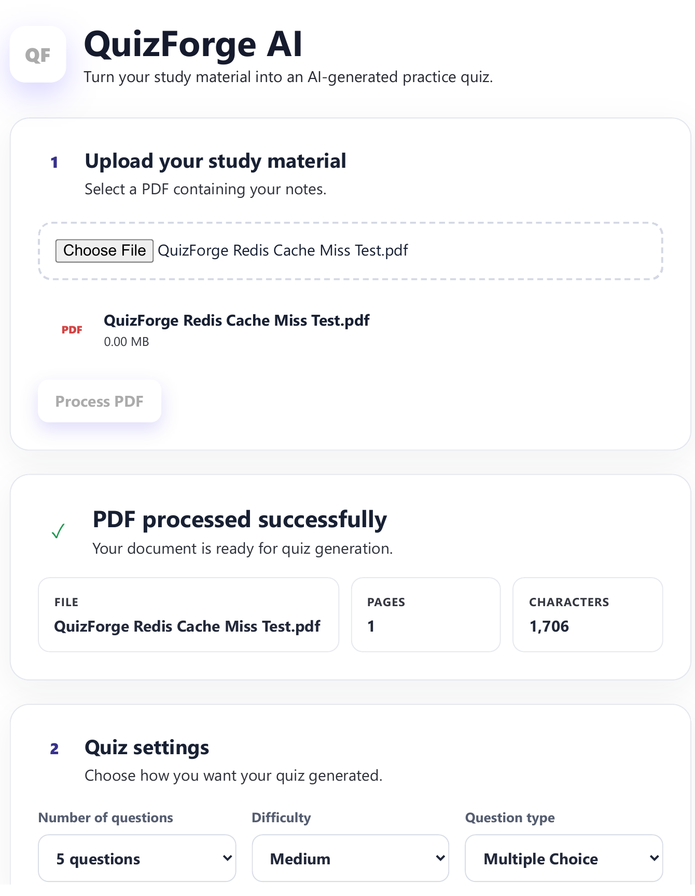
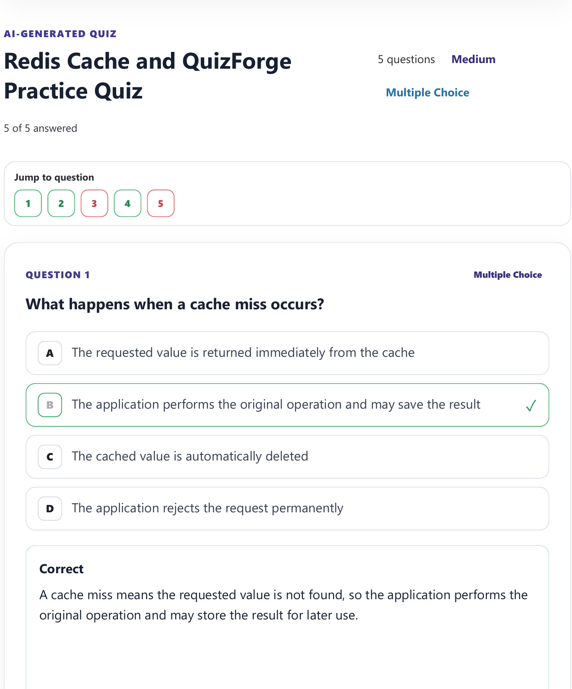
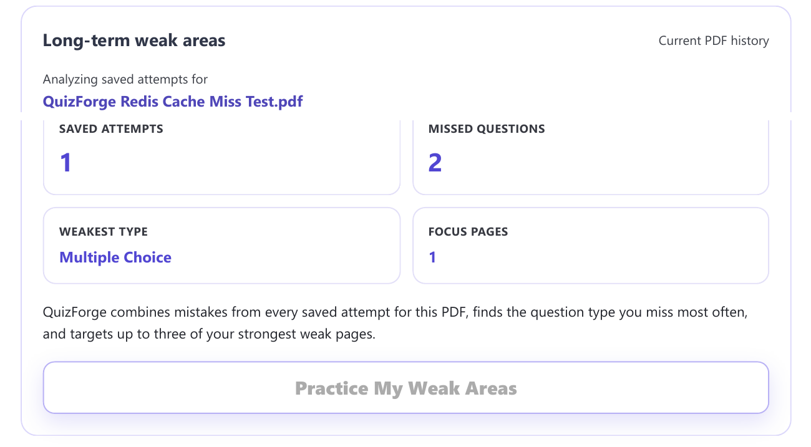
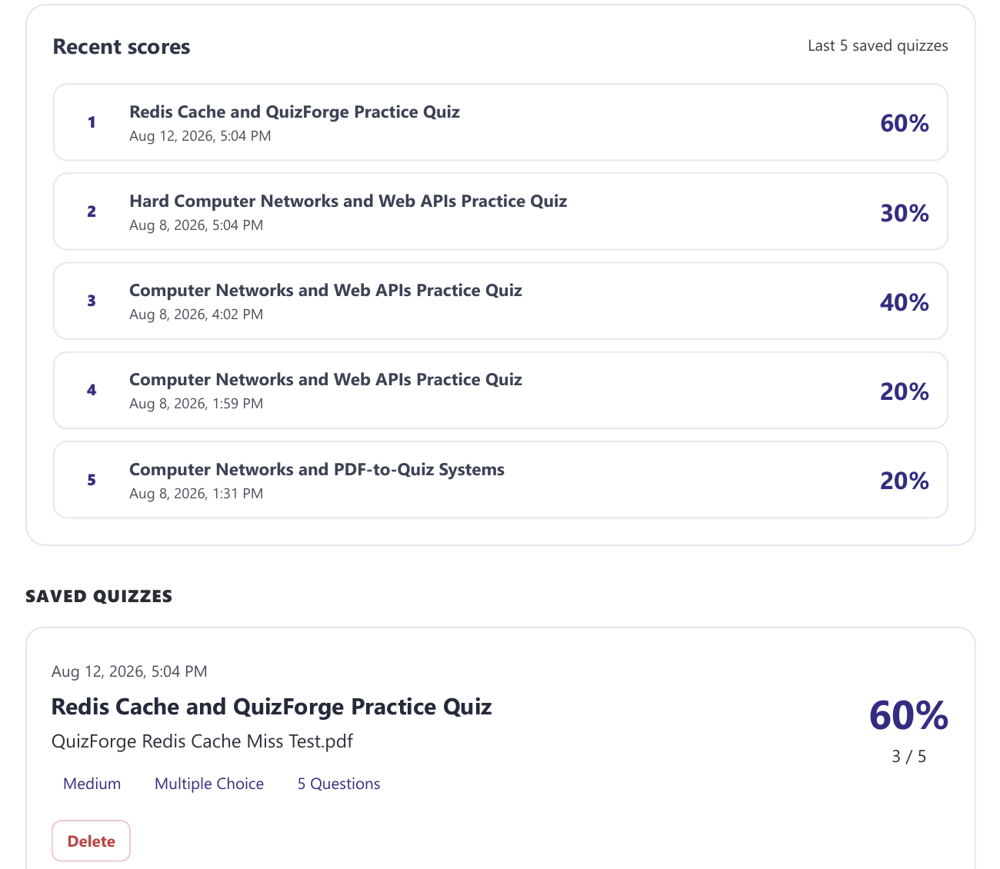
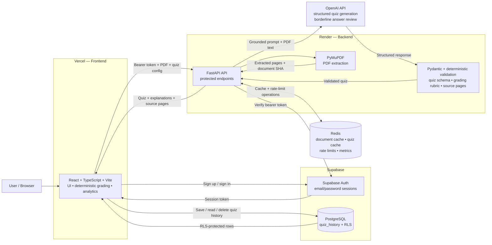

# QuizForge AI

[](https://github.com/HamedGithubforwork/QuizForge-AI/actions/workflows/ci.yml)

**QuizForge AI is a deployed full-stack study platform that turns PDF notes into source-grounded practice quizzes, tracks performance over time, and generates targeted practice from a learner's weak areas.**

[Live Demo](https://quiz-forge-ai-nine.vercel.app) · [Backend API](https://quizforge-ai-api.onrender.com) · [API Health](https://quizforge-ai-api.onrender.com/api/health)

> Production workflow verified end to end: sign in → upload PDF → process text → generate quiz → answer → score → save → history/analytics → weak-area practice.

---

## Why this project

QuizForge AI started as a PDF-to-quiz application and grew into a production-oriented full-stack project. It demonstrates more than an AI API call: authentication, structured AI output, deterministic validation and grading, persistent user history, targeted learning analytics, Redis-backed caching and rate limiting, automated tests, CI, Docker development, and cloud deployment.

### Engineering highlights

- **Grounded AI generation** — quiz questions, answers, explanations, and source pages are generated from the uploaded PDF rather than general model knowledge.
- **Structured validation** — FastAPI/Pydantic schemas and deterministic validators reject malformed quiz or grading data before it reaches the UI.
- **Adaptive practice** — saved attempts are analyzed by question type and source page to create new weak-area quizzes instead of simply repeating missed questions.
- **Production caching** — Redis caches extracted documents and generated quizzes to reduce repeated work and external AI requests.
- **Per-user protection** — authenticated endpoints, Redis-backed rate limiting, Supabase Row Level Security, configurable CORS, and security response headers.
- **Automated quality gates** — backend tests, frontend grading/analytics tests, linting, production builds, dependency audit, and Playwright E2E run in GitHub Actions.
- **Privacy-conscious observability** — structured logs record operational metadata without PDF text, user IDs, Redis keys, raw provider errors, or client IP access logs.

---

## Product flow

1. **Authenticate** with Supabase email/password authentication.
2. **Upload a PDF** and extract selectable text with PyMuPDF.
3. **Configure a quiz** with 5, 10, or 15 questions, difficulty, and question type.
4. **Generate** a source-grounded quiz through the FastAPI/OpenAI backend.
5. **Answer and review** multiple-choice, true/false, and short-answer questions with explanations and source-page references.
6. **Save results** to Supabase PostgreSQL.
7. **Analyze progress** using quiz history, score trends, mastery tracking, weak question types, and weak source pages.
8. **Practice weak areas** with a new targeted quiz that focuses on recent mistakes without repeating the original missed questions.

---

## Screenshots

### Upload and configure



### Generated quiz



### Weak-area practice



### Quiz history and analytics



---

## Features

### Quiz generation

- PDF upload and text extraction
- Scanned/image-based PDF detection
- 5, 10, or 15 questions
- Easy, Medium, and Hard difficulty
- Multiple Choice, True / False, Short Answer, or Mixed modes
- AI-generated explanations
- Source-page references and **View Source** support
- Prompt-injection-resistant instructions that treat PDF content as data rather than commands
- Retry validation when AI output does not satisfy the quiz schema or grading rules

### Quiz experience

- Question navigator
- Unanswered-question detection
- Overall score and per-type score breakdown
- Retry Incorrect
- Generate New Quiz
- Deterministic short-answer grading with concept, exact, and numeric modes
- Compatible numeric-unit conversion for common mass, length, volume, time, percentage, and temperature answers
- Optional AI review for borderline short-answer paraphrases

### Personalized learning

- Persistent quiz history
- Performance analytics
- Recent score trends
- Weak question-type detection
- Weak source-page detection
- Targeted weak-area practice
- Avoidance of previously missed question text when generating follow-up practice
- Mastery tracking based on multiple recent attempts rather than a single high score

### Authentication and account flows

- Sign up and sign in
- Email confirmation
- Sign out
- Forgot password
- Password recovery/reset
- Supabase bearer-session authentication for protected backend requests
- Automatic session refresh/retry for expired frontend API requests

---

## Tech stack

| Layer | Technology |
| --- | --- |
| Frontend | React, TypeScript, Vite, HTML/CSS |
| Backend | Python, FastAPI, Pydantic, HTTPX |
| PDF processing | PyMuPDF |
| AI | OpenAI API with structured responses |
| Database | PostgreSQL via Supabase |
| Authentication | Supabase Auth |
| Caching / rate limiting | Redis |
| Frontend deployment | Vercel |
| Backend deployment | Render |
| Testing | pytest, Node-based TypeScript tests, Playwright |
| CI / DevOps | GitHub Actions, Docker, Docker Compose |

---

## Architecture



### Request and data flow

The architecture intentionally separates **user-facing state**, **protected AI/PDF processing**, and **persistent history**:

1. **Authentication** — the React client signs users in through Supabase Auth and receives a session token.
2. **Protected backend request** — PDF upload and quiz-generation calls go from the browser to FastAPI with the Supabase bearer token.
3. **Backend authentication** — FastAPI verifies that token against Supabase before accepting protected work.
4. **PDF processing** — PyMuPDF extracts page text; Redis can reuse the extracted document for later requests from the same authenticated user/document.
5. **Rate limiting and cache lookup** — Redis tracks per-user quiz-generation limits and checks whether an eligible quiz request can be served from cache.
6. **AI generation** — on a cache miss or intentional bypass, FastAPI sends a grounded prompt and the extracted study material to OpenAI.
7. **Validation boundary** — structured AI output must pass the Pydantic schema and deterministic quiz/grading/source-page validation before FastAPI returns it to the browser.
8. **Client grading and learning flow** — the React application handles normal deterministic grading, score breakdowns, history analytics, mastery calculations, and weak-area selection. Borderline short-answer cases can optionally call the protected AI review endpoint.
9. **Persistent history** — the frontend saves and reads `quiz_history` directly through the Supabase client; PostgreSQL Row Level Security restricts rows to the authenticated user.
10. **Targeted practice** — weak-area settings are sent back through FastAPI for a new quiz. The quiz cache can be intentionally bypassed while the document cache is still reused.

### Trust boundaries

| Boundary | Responsibility |
| --- | --- |
| Browser → FastAPI | Bearer-authenticated PDF/AI requests; no OpenAI secret is exposed to the client |
| Browser → Supabase | Authenticated history CRUD protected by PostgreSQL RLS |
| FastAPI → Supabase Auth | Server-side verification of the user's bearer session |
| FastAPI → Redis | User-scoped cache fingerprints, shared rate limiting, and operational metrics |
| FastAPI → OpenAI | Server-side provider credential and grounded/structured generation |
| OpenAI → FastAPI | AI output is treated as untrusted until deterministic validation passes |

---

## Redis caching and rate limiting

Quiz generation can involve PDF extraction and an external AI request, so QuizForge uses Redis for two independent caches:

- **Document cache** — reuses extracted PDF pages for the same authenticated user/document.
- **Quiz cache** — reuses an already generated quiz for an identical eligible request.

Default TTLs:

```text
Document cache: 86400 seconds (24 hours)
Quiz cache:      3600 seconds (1 hour)
```

Quiz-generation traffic is also protected by a Redis-backed per-user limiter. The default is:

```text
10 quiz-generation requests per 600 seconds
```

If the Redis rate-limit backend is unavailable, QuizForge falls back to an in-memory limiter rather than removing protection entirely.

---

## Reliability and security

The project includes several production-oriented safeguards:

- Supabase session verification on protected backend routes
- PostgreSQL Row Level Security for quiz history
- Server-side OpenAI credentials
- Configurable production CORS allowlist
- `X-Content-Type-Options`, `Referrer-Policy`, and `Permissions-Policy` response headers
- PDF MIME/type, size, and text-extraction validation
- Scanned-PDF detection before AI generation
- Per-user quiz-generation rate limiting
- Structured quiz/rubric validation before returning AI output
- Generic client-facing provider errors
- Structured redacted operational logging
- No Uvicorn client-IP access logging in production

Secrets are provided through environment variables and are not committed to the repository.

---

## Testing and CI

GitHub Actions runs three independent jobs on pushes and pull requests to `main`:

### Backend tests

- Python 3.11
- Redis 7 service container
- `pytest`
- API/authentication/PDF validation
- Redis cache and rate-limit behavior
- observability/admin metrics
- answer review and quiz validation
- disposable real-Redis integration tests

### Frontend checks

- Node 22
- production dependency audit
- TypeScript grading, document-identity, fallback, weak-area, mastery, and request-policy tests
- oxlint
- production Vite build

### Playwright E2E

- Chromium
- authentication UI flow
- PDF processing and quiz flow with mocked services
- answering/scoring
- source references
- save/history behavior
- weak-area practice
- short-answer history behavior

Run the main local checks with:

```bash
# Backend
cd backend
pip install -r requirements-dev.txt
python -m pytest -q

# Frontend
cd ../frontend
npm ci
npm run lint
npm run build

# E2E (from repository root)
npm ci --prefix e2e
npx --prefix e2e playwright install chromium
npm --prefix e2e test
```

The exact frontend TypeScript test commands used by CI are documented in `.github/workflows/ci.yml`.

---

## Local development

### Prerequisites

- Git
- Python 3.11+ recommended
- Node.js 22+
- Redis, or Docker Desktop
- Supabase project
- OpenAI API key

### Option 1 — Docker Compose

Clone the repository:

```bash
git clone https://github.com/HamedGithubforwork/QuizForge-AI.git
cd QuizForge-AI
```

Create local environment files from the included templates:

```text
backend/.env.example  → backend/.env
frontend/.env.example → frontend/.env.local
```

Fill in your Supabase/OpenAI values, then start the stack:

```bash
docker compose up --build
```

Local services:

```text
Frontend  http://localhost:5173
Backend   http://localhost:8000
Redis     internal Docker service
```

Stop the stack with:

```bash
docker compose down
```

### Option 2 — Run services manually

Backend:

```bash
cd backend
python -m venv .venv
```

Windows PowerShell:

```powershell
.\.venv\Scripts\Activate.ps1
```

macOS/Linux:

```bash
source .venv/bin/activate
```

Install and run:

```bash
pip install -r requirements.txt
uvicorn main_redis:app --reload
```

When Redis is running directly on your machine rather than through Docker, use a local URL such as:

```env
REDIS_URL=redis://127.0.0.1:6379/0
```

Frontend, in another terminal:

```bash
cd frontend
npm ci
npm run dev
```

---

## Environment variables

Use the committed example files as the source of truth.

### Backend

```env
OPENAI_API_KEY=
SUPABASE_URL=
SUPABASE_PUBLISHABLE_KEY=
ALLOWED_ORIGINS=http://localhost:5173,http://127.0.0.1:5173
REDIS_URL=redis://redis:6379/0

QUIZ_RATE_LIMIT=10
QUIZ_RATE_WINDOW_SECONDS=600
QUIZ_CACHE_TTL_SECONDS=3600
QUIZ_CACHE_VERSION=v1
DOCUMENT_CACHE_TTL_SECONDS=86400
DOCUMENT_CACHE_MAX_BYTES=1500000
DOCUMENT_CACHE_VERSION=v1
LOG_LEVEL=INFO
```

### Frontend

```env
VITE_SUPABASE_URL=
VITE_SUPABASE_PUBLISHABLE_KEY=
VITE_API_URL=http://127.0.0.1:8000
```

Never commit real secret values.

---

## Production deployment

QuizForge uses a split cloud architecture:

- **Frontend — Vercel:** https://quiz-forge-ai-nine.vercel.app
- **Backend — Render:** https://quizforge-ai-api.onrender.com
- **Database/Auth — Supabase:** PostgreSQL, Auth, and RLS
- **Cache/Rate limiting — Redis:** production Redis-compatible service

Render starts the production API with:

```bash
uvicorn main_redis:app --host 0.0.0.0 --port $PORT --no-access-log
```

The `--no-access-log` flag prevents Uvicorn from writing client IP addresses to application logs; QuizForge's structured request logs retain only operational fields such as method, route, status, duration, and a random request ID.

> The free Render web service can cold-start after inactivity, so the first backend request may take longer than subsequent requests.

---

## Current status

QuizForge AI is deployed and supports the complete production workflow from authentication and PDF upload through quiz generation, deterministic grading, persistent history, analytics, and targeted weak-area practice.

Current limitations include:

- image-only/scanned PDFs are detected but OCR is not implemented yet
- AI generation requires an external provider request on cache miss/bypass
- the free backend tier may cold-start after inactivity

---

## Repository structure

```text
QuizForge-AI/
├── backend/              FastAPI API, PDF processing, Redis integration, tests
├── frontend/             React + TypeScript application
├── e2e/                  Playwright end-to-end tests
├── docs/screenshots/     README product screenshots
├── supabase/migrations/  Database/RLS migrations
├── .github/workflows/    GitHub Actions CI
├── docker-compose.yml    Local full-stack development
└── render.yaml           Render production configuration
```

---

## Author

**Hamed Vasheghani Farahani**  
Computer Science student at Concordia University.

GitHub: https://github.com/HamedGithubforwork
