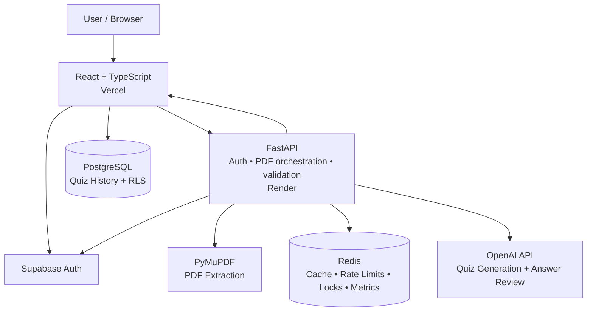

# QuizForge AI

[](https://github.com/HamedGithubforwork/QuizForge-AI/actions/workflows/ci.yml)

**QuizForge AI is a deployed full-stack study platform that turns PDF notes into source-grounded practice quizzes, tracks performance over time, and generates targeted practice from a learner's weak areas.**

[Live Demo](https://quiz-forge-ai-nine.vercel.app) · [Backend API](https://quizforge-ai-api.onrender.com) · [API Health](https://quizforge-ai-api.onrender.com/api/health)

> The production application supports the full learner workflow: sign in → upload PDF → process text → generate quiz → answer → score → save → history/analytics → weak-area practice.

---

## Why this project

QuizForge AI started as a PDF-to-quiz application and grew into a production-oriented full-stack project. It demonstrates authentication, structured AI output, deterministic validation and grading, persistent user history, mastery analytics, Redis-backed caching and rate limiting, automated browser/integration testing, observability, Docker development, and cloud deployment.

### Engineering highlights

- **Grounded AI generation** — questions, answers, explanations, and source pages must be supported by the uploaded PDF.
- **Structured validation** — FastAPI/Pydantic schemas and deterministic validators reject malformed generated quizzes and grading rubrics before they reach the browser.
- **Stable document identity** — SHA-256 document identity keeps history associated with the same PDF even when a file is renamed.
- **Adaptive practice** — saved attempts are analyzed by question type and source page to create new weak-area quizzes rather than simply repeating missed questions.
- **Production caching** — Redis caches extracted document data and eligible generated quizzes and supports source-page retrieval without repeatedly loading full processed documents.
- **Distributed coordination** — Redis also backs per-user rate limiting, generation single-flight locking, and operational metrics, with safe process-local fallbacks where designed.
- **Automated quality gates** — pytest, frontend domain tests, lint/build checks, Playwright browser tests, real local-stack integration, database migration verification, security audits, and production smoke checks run through GitHub Actions.
- **Privacy-conscious observability** — structured logs and performance metrics avoid PDF text, bearer tokens, user IDs, Redis keys, raw provider errors, and default IP-bearing Uvicorn access logs.

---

## Product flow

1. **Authenticate** with Supabase email/password authentication.
2. **Upload a PDF** and extract selectable text with PyMuPDF.
3. **Configure a quiz** with 5, 10, or 15 questions, difficulty, and question type.
4. **Generate** a source-grounded quiz through FastAPI and OpenAI.
5. **Answer and review** multiple-choice, true/false, and short-answer questions with explanations and source-page references.
6. **Save results** to Supabase PostgreSQL.
7. **Analyze progress** using quiz history, score trends, mastery tracking, weak question types, and weak source pages.
8. **Practice weak areas** with a new targeted quiz focused on recent mistakes without repeating the original missed questions.

---

## Screenshots

### Upload, process, and configure


### Answer review and explanations


> The live demo contains the current history/mastery analytics and targeted weak-area practice UI. Older screenshots of those views were intentionally removed so the portfolio does not show stale production screens.

---

## Features

### Quiz generation

- PDF upload and text extraction
- Scanned/image-based PDF detection
- 5, 10, or 15 questions
- Easy, Medium, and Hard difficulty
- Multiple Choice, True / False, Short Answer, or Mixed modes
- AI-generated explanations
- Source-page references and authenticated **View Source** retrieval
- Prompt-injection-resistant instructions that treat PDF content as untrusted study material rather than instructions
- Deterministic validation and one regeneration attempt when AI output violates the quiz/grading contract
- Processed-document reuse so later generations can reference a user-scoped document SHA instead of retransmitting the PDF bytes
- Generate New Quiz cache bypass while still reusing safe processed-document work

### Quiz experience

- Question navigator
- Unanswered-question detection
- Overall score and per-type score breakdown
- Retry Incorrect
- Generate New Quiz
- Deterministic short-answer grading with concept, exact, and numeric modes
- Compatible numeric-unit conversion for common mass, length, volume, time, percentage, and temperature answers
- Optional conservative AI review for borderline short-answer paraphrases
- Lazy source-page retrieval with bounded frontend caching

### Personalized learning

- Persistent quiz history
- Stable PDF identity across renamed copies
- Lazy-loaded history
- Cursor-based history pagination
- Performance analytics
- Recent score trends
- Weak question-type detection
- Weak source-page detection
- Targeted weak-area practice
- Avoidance of previously missed question text when generating follow-up practice
- Mastery tracking based on repeated recent evidence rather than a single high score

### Authentication and account flows

- Sign up and sign in
- Email confirmation
- Sign out
- Forgot password
- Password recovery/reset
- Supabase bearer-session authentication for protected backend requests
- Automatic session refresh/retry for expired frontend API requests

---

## Tech stack

| Layer | Technology |
| --- | --- |
| Frontend | React, TypeScript, Vite, HTML/CSS |
| Backend | Python, FastAPI, Pydantic, HTTPX |
| PDF processing | PyMuPDF |
| AI | OpenAI API with structured responses |
| Database | PostgreSQL via Supabase |
| Authentication | Supabase Auth |
| Caching / rate limiting / coordination | Redis |
| Frontend deployment | Vercel |
| Backend deployment | Render |
| Testing | pytest, Node-based TypeScript tests, Playwright |
| CI / DevOps | GitHub Actions, Docker, Docker Compose, Supabase CLI |

---

## Architecture



### Responsibility boundaries

- **React on Vercel** owns the interface, deterministic client-side grading, quiz session state, saved-history views, analytics, and weak-area selection.
- **Supabase Auth** owns user sessions. FastAPI verifies bearer sessions server-side before protected PDF/AI work.
- **Supabase PostgreSQL** stores quiz history. The browser uses the Supabase client under Row Level Security so users are restricted to their own rows.
- **FastAPI on Render** owns protected PDF orchestration, server-side secrets, request validation, provider calls, generated-quiz validation, rate-limit enforcement, and cache/processed-document coordination.
- **PyMuPDF** extracts selectable text and page boundaries from uploaded PDFs.
- **Redis** provides document/quiz/source caches, per-user rate limits, generation single-flight locking, and operational metrics. Correctness paths degrade safely when Redis is unavailable according to the backend fallback design.
- **OpenAI** generates structured quiz data and performs conservative semantic review for selected borderline short answers. Provider output is not trusted merely because it parses.

### Main request paths

| Flow | Path |
| --- | --- |
| Sign in | Browser → Supabase Auth |
| Upload/process PDF | Browser → FastAPI → PyMuPDF / Redis |
| Generate quiz | Browser → FastAPI → Redis / OpenAI |
| Verify protected request | FastAPI → Supabase Auth |
| Save/load history | Browser → Supabase PostgreSQL under RLS |
| View cited source | Browser → FastAPI → user-scoped processed source cache |
| Weak-area practice | Browser analytics → FastAPI → new grounded quiz |

---

## Redis caching, rate limiting, and coordination

Quiz generation can involve PDF extraction and an external AI request, so QuizForge separates reusable document work from generated-quiz caching.

- **Document cache** — reuses extracted PDF pages for the same authenticated user/document.
- **Processed-document/source cache** — retains server-side page data so the browser can generate again using `document_sha256` and lazily fetch cited pages without resending full PDF bytes.
- **Quiz cache** — reuses an already generated quiz for an identical eligible request.
- **Single-flight lock** — prevents duplicate concurrent work for identical quiz-generation requests; explicit fresh-generation requests remain fresh while being serialized.
- **Rate limits** — quiz generation and semantic answer review use separate per-user policies.
- **Metrics** — Redis stores aggregate counters and bounded timing samples used by the authenticated admin metrics endpoint.

Default document and quiz cache TTLs are:

```text
Document cache: 86400 seconds (24 hours)
Quiz cache:      3600 seconds (1 hour)
```

Default quiz-generation rate limit:

```text
10 requests per 600 seconds
```

Redis failures do not silently disable security or fabricate cache success. Rate limiting falls back to process-local enforcement, while cache/processed-document paths follow their explicit safe-degradation behavior.

---

## Security and production engineering

QuizForge treats authentication, AI output, uploaded documents, external providers, persistent data, caches, and logs as separate trust boundaries.

| Area | Implementation |
| --- | --- |
| Authentication | Protected FastAPI routes require a Supabase bearer token. Invalid/expired sessions return `401`; authentication-provider failures fail closed with a generic `503`. |
| Data isolation | Quiz history uses Supabase RLS and user-scoped policies. Browser-facing table privileges are restricted to the operations the app requires. |
| Secret handling | OpenAI and other server-only credentials remain in backend environment variables. Example environment files contain placeholders only. |
| CORS / browser boundary | Backend CORS uses an explicit environment-controlled allowlist and restricted methods/headers. |
| Security headers | Production responses are checked for anti-sniffing, referrer, framing, permissions, and transport-security headers. |
| PDF / request validation | Uploads must be PDFs, are capped at 15 MB, and are parsed by PyMuPDF. Quiz generation validates text volume, question settings, focus pages, weak-area inputs, and processed-document identity. |
| AI trust boundary | PDF text is treated as data, not instructions. OpenAI output must satisfy Pydantic schemas and deterministic structural/grading/source-page validation before reaching the client. |
| Abuse protection | Quiz generation and semantic answer review are independently rate-limited; distributed Redis enforcement has bounded in-memory fallback behavior. |
| Cache isolation | Cache/document identities are scoped by authenticated user plus document/request identity. |
| Admin surface | `/api/admin/metrics` requires both a valid session and membership in `ADMIN_USER_IDS`; access fails closed when the allowlist is absent. |
| Observability / privacy | Structured logs record operational metadata and timing data without request bodies, bearer tokens, PDF text, user IDs, Redis keys, or raw provider exception messages. |

### Failure behavior

- **Supabase Auth unavailable** → protected requests fail closed with a generic `503`.
- **Redis rate-limit backend unavailable** → rate limiting falls back to in-memory enforcement.
- **Redis cache unavailable** → cache work degrades safely rather than returning fabricated hits.
- **OpenAI/provider error** → the server logs only redacted operational metadata and returns a generic provider failure.
- **Malformed AI output** → deterministic validation rejects it; one regeneration attempt is allowed before returning an error.
- **Unexpected request failure** → structured observability records request ID, route, duration, and exception type without raw request/provider content.

### Production privacy hardening

Render starts the canonical FastAPI application with:

```bash
uvicorn main:app --host 0.0.0.0 --port $PORT --no-access-log
```

The `--no-access-log` flag disables Uvicorn's default IP-bearing access log while QuizForge's own structured request middleware retains privacy-conscious operational fields.

---

## Testing and CI

QuizForge uses several verification layers. Workflows are **path-sensitive**: a pull request or push runs the checks relevant to the files it changes instead of unconditionally rerunning every job.

| Layer | Workflow / job | What it protects |
| --- | --- | --- |
| Backend | **CI → Backend tests** | API behavior, auth enforcement, PDF validation, Redis behavior, metrics, AI review normalization, generated-quiz validation, Docker build |
| Frontend | **CI → Frontend checks** | grading, numeric units, history consistency, fallback logic, document identity, analytics/mastery, pagination, lint and production build |
| Browser | **CI → Playwright E2E** | authentication UI, upload/generate/score flows, source retrieval, history, weak-area practice, accessibility/keyboard behavior |
| Real local stack | **Local stack integration** | Browser + local Supabase + FastAPI + Redis, RLS isolation, migrations, document cache behavior |
| Database | **Database migrations** | Rebuilds local Supabase from zero and verifies schema/security reproducibility |
| Dependencies | **Security checks** | `pip-audit` and npm dependency audits on dependency changes plus scheduled/manual runs |
| Production | **Deployment smoke** | Scheduled/manual read-only checks of deployed Vercel/Render wiring, health, headers, CORS, and unauthenticated admin protection |

### Backend tests

The backend pytest suite covers API contracts, authentication requirements, PDF validation/extraction, stable document identity, Redis caching/rate limiting, processed-document/source caching, generation coordination, observability, admin metrics, answer review, and deterministic generated-quiz validation.

CI starts a disposable `redis:7-alpine` service through `TEST_REDIS_URL`, so real-Redis tests exercise actual protocol/TTL/locking behavior without touching production Redis.

### Frontend logic checks

The current frontend CI job runs these focused TypeScript tests directly under Node before linting and building:

```text
shortAnswerGrader.test.ts
numericUnitGrading.test.ts
historyQuestionGrader.test.ts
answerFallback.test.ts
documentIdentity.test.ts
weakAreaAnalytics.test.ts
masteryAnalytics.test.ts
quizGenerationPolicy.test.ts
quizHistoryPagination.test.ts
```

It then runs:

```bash
npm run lint
npm run build
```

Dependency auditing is owned by the separate **Security checks** workflow rather than duplicated in normal frontend CI.

### Playwright E2E

The standard browser suite currently includes:

- `quizforge.spec.ts` — authentication UI, upload/process/generate, answering/scoring, explanations/source pages, save/history, weak-area practice, and invalid-login handling
- `short-answer-history.spec.ts` — short-answer grading/history persistence and document identity behavior
- `source-page-cache.spec.ts` — lazy source retrieval and frontend source-cache behavior
- `accessibility.spec.ts` — keyboard/accessibility-focused browser behavior

Standard Playwright tests mock external services at the browser network layer so CI stays deterministic and does not spend OpenAI credits.

A separate integration Playwright configuration runs against local Supabase, FastAPI, and Redis for real cross-service verification.

### Production smoke testing

`.github/workflows/deployment-smoke.yml` runs a scheduled and manually dispatchable **read-only** production smoke check. It deliberately avoids authentication, database writes, PDF uploads, Redis mutations, and OpenAI calls. It verifies:

- Vercel frontend reachability and deployed JS bundle wiring
- Render backend health/root contracts
- production security response headers
- unauthenticated denial of `/api/admin/metrics`
- production frontend-origin CORS preflight

This is separate from the previously exercised full authenticated production workflow: deterministic CI stays reproducible, while the scheduled smoke checks public deployment wiring without mutating production state.

### Run the main checks locally

```bash
# Backend
cd backend
pip install -r requirements-dev.txt
python -m pytest -q

# Frontend
cd ../frontend
npm ci
node --experimental-strip-types src/lib/shortAnswerGrader.test.ts
node --experimental-strip-types src/lib/numericUnitGrading.test.ts
node --experimental-strip-types src/lib/historyQuestionGrader.test.ts
node --experimental-strip-types src/lib/answerFallback.test.ts
node --experimental-strip-types src/lib/documentIdentity.test.ts
node --experimental-strip-types src/lib/weakAreaAnalytics.test.ts
node --experimental-strip-types src/lib/masteryAnalytics.test.ts
node --experimental-strip-types src/lib/quizGenerationPolicy.test.ts
node --experimental-strip-types src/lib/quizHistoryPagination.test.ts
npm run lint
npm run build

# Standard E2E (repository root)
npm ci --prefix e2e
npx --prefix e2e playwright install chromium
npm --prefix e2e test
```

See `.github/workflows/` and `e2e/README.md` for the complete CI and integration commands.

---

## Local development

### Prerequisites

- Git
- Python 3.11.16 (repository runtime baseline)
- Node.js 22+
- Redis, or Docker Desktop
- Supabase project
- OpenAI API key

### Option 1 — Docker Compose

```bash
git clone https://github.com/HamedGithubforwork/QuizForge-AI.git
cd QuizForge-AI
```

Create local environment files from the committed examples:

```text
backend/.env.example  → backend/.env
frontend/.env.example → frontend/.env.local
```

Fill in your Supabase/OpenAI values, then start the stack:

```bash
docker compose up --build
```

Local services:

```text
Frontend  http://localhost:5173
Backend   http://localhost:8000
Redis     internal Docker service
```

Stop the stack with:

```bash
docker compose down
```

### Option 2 — Run services manually

Backend:

```bash
cd backend
python -m venv .venv
```

Windows PowerShell:

```powershell
.\.venv\Scripts\Activate.ps1
```

macOS/Linux:

```bash
source .venv/bin/activate
```

Install and run:

```bash
pip install -r requirements.txt
uvicorn main:app --reload
```

When Redis runs directly on the machine, use a URL such as:

```env
REDIS_URL=redis://127.0.0.1:6379/0
```

Frontend, in another terminal:

```bash
cd frontend
npm ci
npm run dev
```

---

## Environment variables

Use the committed `.env.example` files as the source of truth. Backend configuration currently includes:

```env
OPENAI_API_KEY=your_openai_api_key
SUPABASE_URL=https://your-project.supabase.co
SUPABASE_PUBLISHABLE_KEY=your_publishable_key
ALLOWED_ORIGINS=http://localhost:5173,http://127.0.0.1:5173

REDIS_URL=redis://redis:6379/0
QUIZ_RATE_LIMIT=10
QUIZ_RATE_WINDOW_SECONDS=600
ANSWER_REVIEW_RATE_LIMIT=20
ANSWER_REVIEW_RATE_WINDOW_SECONDS=600
QUIZ_CACHE_TTL_SECONDS=3600
QUIZ_CACHE_VERSION=v1
QUIZ_GENERATION_LOCK_TTL_SECONDS=120
QUIZ_GENERATION_WAIT_SECONDS=30
DOCUMENT_CACHE_TTL_SECONDS=86400
DOCUMENT_CACHE_MAX_BYTES=1500000
DOCUMENT_CACHE_VERSION=v1

LOG_LEVEL=INFO
```

Frontend configuration uses:

```env
VITE_SUPABASE_URL=
VITE_SUPABASE_PUBLISHABLE_KEY=
VITE_API_URL=http://127.0.0.1:8000
```

Never commit real secret values.

---

## Production deployment

QuizForge uses a split cloud architecture:

- **Frontend — Vercel:** https://quiz-forge-ai-nine.vercel.app
- **Backend — Render:** https://quizforge-ai-api.onrender.com
- **Database/Auth — Supabase:** PostgreSQL, Auth, and RLS
- **Cache/Rate limiting — Redis:** production Redis-compatible service

The committed Render configuration uses the canonical backend entrypoint:

```bash
uvicorn main:app --host 0.0.0.0 --port $PORT --no-access-log
```

Render is configured to deploy after checks pass. Production secrets remain external to the repository.

> The free Render web service can cold-start after inactivity, so the first backend request may take longer than subsequent requests.

---

## Current limitations

- Image-only/scanned PDFs are detected but OCR is not implemented yet.
- Quiz generation rejects documents whose extracted text exceeds the current AI-input limit.
- AI generation requires an external provider request on cache miss/bypass.
- Processed-document/cache data is intentionally temporary and can expire, requiring the PDF to be processed again.
- The free backend tier may cold-start after inactivity.

---

## Repository structure

```text
QuizForge-AI/
├── backend/              FastAPI API, PDF processing, Redis integration, tests
├── frontend/             React + TypeScript application
├── e2e/                  Playwright standard + local-stack integration tests
├── docs/screenshots/     README product screenshots
├── scripts/              Read-only production smoke tooling
├── supabase/migrations/  Database/RLS migrations
├── supabase/tests/       Schema/security reproducibility checks
├── .github/workflows/    CI, integration, migration, security, smoke workflows
├── docker-compose.yml    Local full-stack development
└── render.yaml           Render production configuration
```

---

## Author

**Hamed Vasheghani Farahani**  
Computer Science student at Concordia University.

GitHub: https://github.com/HamedGithubforwork
