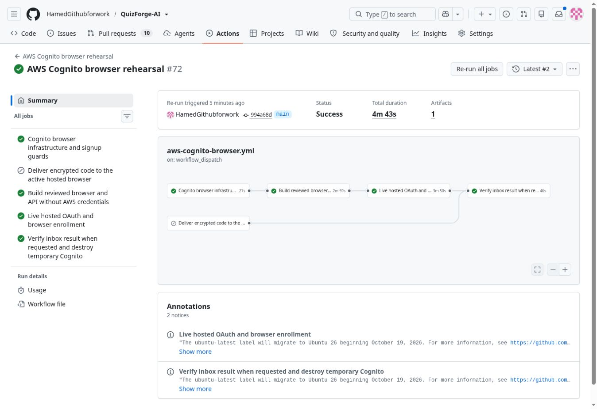

# Lightsail acceptance checks — September 21, 2026

**Permanent launch remains blocked.** A successful inventory workflow means the
inspection completed; it does not mean the inspected prerequisites exist.

This review targets application `807a4084237f6db544620cdb8322108ebf52251c`
and permanent configuration `2723c8246ba6afc9e6cfdb00cec4dc85153f3913`.
The trusted AWS controllers ran from main
`994a68dccc2a18c0551f8969f6da819a30f5d7d4`. Application PR127 and permanent
configuration PR155 remain draft and unmerged. No production routing, user-data
migration or permanent deployment was performed.

## Fresh checks

| Check | Result | Evidence and limit |
| --- | --- | --- |
| AWS account and budget inventory | Inspection passed; budget absent | [Run 35637544132](https://github.com/HamedGithubforwork/QuizForge-AI/actions/runs/35637544132): active account plan; no AWS budgets returned. The approved USD20 choice and recipient are saved configuration, not active notifications. |
| Production routing | Not configured in the inspected Route53 zone | The inventory found only apex NS/SOA records, with no apex, www or API application records. No production-name ACM certificates were returned. The selected Caddy deployment uses its own ACME certificates, so ACM absence alone is not a Caddy failure; final public TLS is untested. |
| DNS delegation and staging certificate | Passed | [Run 35637896165](https://github.com/HamedGithubforwork/QuizForge-AI/actions/runs/35637896165): public delegation, issued certificate for `staging-api.quizfromnotes.com`, and unused staging hostname verified. This is not a production HTTPS canary. |
| Lightsail prerequisites and old-test cleanup | Passed, read-only | [Run 35637952319](https://github.com/HamedGithubforwork/QuizForge-AI/actions/runs/35637952319): Canada Central `small_3_0` available at USD12/month, 2 GB / 2 vCPU / 60 GB; reviewed deletion role and scheduler group present; no previous capacity-test instance remains. Zero mutations and no load test in this run. |
| Current application login and MFA | Passed on the second attempt; first failure retained | [Run 35637807448](https://github.com/HamedGithubforwork/QuizForge-AI/actions/runs/35637807448), `operation=run`, application PR127. Hosted login/TOTP, PKCE/nonce, JWT/GetUser, history CRUD and isolation, one-use enrollment, unverified-email denial, logout/revocation and same-browser password/TOTP sign-in passed in job 106462932488. |

The first authentication attempt failed in job 106460732265 after the initial
login, enrollment and history checks passed. Its broad diagnostic label was
`mapped: mandatory TOTP`, but the error was an `AssertionError` in the OAuth
assertions after MFA submission and the return redirect. The exact token/PKCE/nonce
assertion was not logged, so the root cause is **not established**. The failure
must not be described as a proven MFA bypass or a confirmed product fix. One
bounded retry of the same job and immutable application images passed; no
application code was changed to make it pass. Retain the intermittent failure
for final-domain testing rather than treating a retry as a reliability guarantee.

The first attempt's cleanup job 106462076086 verified the temporary pool, users,
clients, domain, Lambda, IAM role, logs and recovery parameters were absent before
the retry started. Retry cleanup job **106464309335** independently verified the
same resources were absent, including the temporary recovery parameters and
Terraform rehearsal output. No test pool was left running. Machine-readable
results are retained in [the evidence JSON](evidence/lightsail-acceptance-2026-09-21.json).

## Valid earlier evidence

These results retain their original scope; they are not retests on the permanent
host, final hostname or retained production Cognito pool.

- **Real signup email confirmation:** [run 35220073225](https://github.com/HamedGithubforwork/QuizForge-AI/actions/runs/35220073225),
  job 105197746013, September 17. The dedicated inbox signup reached `CONFIRMED`
  with `email_verified=true`. Pool, users, clients, domain, Lambda, role and logs
  were subsequently verified absent.
- **Real email password recovery:** [run 35230452791](https://github.com/HamedGithubforwork/QuizForge-AI/actions/runs/35230452791),
  job 105232876751, September 17. Wrong code and weak password were rejected;
  the real inbox code completed recovery; old password and fresh pre-reset
  provider access/refresh sessions were rejected; reset code reuse failed;
  existing TOTP and the same subject were preserved. Cleanup passed.
- **Hosted browser recovery:** [run 35408102578](https://github.com/HamedGithubforwork/QuizForge-AI/actions/runs/35408102578),
  job 105802499051, September 19 UTC. Real hosted forgot-password and reset forms,
  email receipt, pre-expiry session revocation, protected history, preserved MFA,
  and cookie logout passed. Cleanup job 105803727681 passed. Provider session
  revocation does not promise immediate invalidation of every locally verified
  JWT; those remain subject to the application's short token expiry.
- **Real model call:** [single AI canary](ai-live-canary.md) passed on the current
  application: five questions in 6.72728 seconds, one upstream request, conservative
  USD0.0006025 settlement. No additional paid model request was made for this review.
- **Runtime and monetary controls:** [AI cost controls](ai-cost-controls.md) and
  [configuration rehearsal](https://github.com/HamedGithubforwork/QuizForge-AI/actions/runs/35566589726)
  passed 29 tests and real PostgreSQL TLS, separate roles, disabled-spend behavior
  and Docker startup/restart. These were CI checks, not live host-load measurements.
- **Encrypted logical recovery:** [backup automation](lightsail-backup-automation.md)
  passed [21 tests](https://github.com/HamedGithubforwork/QuizForge-AI/actions/runs/35566589732)
  with real separate PostgreSQL databases and a local S3 protocol fixture.
  It does not prove live S3 upload/download, email alert delivery or whole-host RTO.

## Remaining work before launch

1. **Run the exact six-container stack under load with concurrent backups on the
   actual 2 GB host.** The trusted capacity controller still pins app
   `bff2ab7612951fe1612268af3772794651ea86c8` and the older single-container synthetic
   laboratory. Its exact-commit guard correctly refuses the newer PR127 head.
   Updating only that pin would still not test the six-container production stack.
   A reviewed replacement harness must retain the external cleanup deadline,
   isolated synthetic data, aggregate 1,536 MiB/no-swap boundary, actual container
   limits, and memory/OOM/latency evidence while the 256 MiB backup job runs.
2. **Provision and verify off-host recovery and alerting.** Backup Terraform is
   prepared but unapplied, with no activation workflow. The exporter deliberately
   binds to the retained production backup bucket; do not repoint it to an
   arbitrary bucket or silently apply production Terraform for a test. A reviewed
   rehearsal needs isolated source/restore databases, independently retained keys,
   separate upload/recovery credentials, actual S3 versions and receipts, full-host
   rebuild timing, and confirmed SNS failure/stale/missing-heartbeat delivery.
3. **Activate the approved USD20 AWS alert budget.** The fresh inventory proves
   no budget exists. AWS Billing could not be opened in this browser (the page
   returned `Site Unavailable` after a retry). No budget was created. The prepared
   production budget uses SNS; its email subscription and test notification must
   be confirmed before claiming working alerts. No alert recipient is included
   in this public evidence.
4. **Complete permanent deployment inputs and final-domain acceptance.** Supply
   the operator SSH public key and current IPv4 `/32`, choose the additional
   daily/monthly request ceilings, and record the reviewed images and actual
   production identity configuration. The full resource plan, installation,
   public Caddy HTTPS, final callback/logout origins and production-pool signup,
   MFA and recovery remain separate launch gates.
5. **Reconcile data and spend before enabling traffic.** Validate account/history
   migration and rollback. Carry the one September AI test attempt and 602,500
   nano-USD into the launch ledger exactly once, together with other applicable
   provider usage. Keep generation disabled until reconciliation is complete.

The existing working site was not cut over. This evidence does not authorize a
permanent launch and must not be represented as an all-clear.
